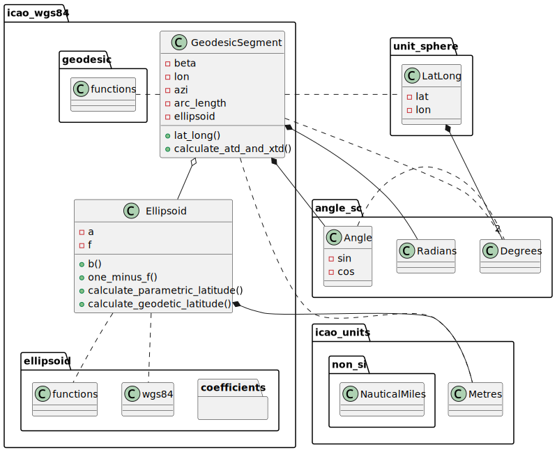

# icao-wgs84

[](https://crates.io/crates/icao-wgs84)
[](https://docs.rs/icao-wgs84/)
[](https://opensource.org/license/mit/)
[](https://github.com/kenba/icao-wgs84-rs/actions)
[](https://codecov.io/gh/kenba/icao-wgs84-rs)

A library for performing geometric calculations on the
[WGS84](https://en.wikipedia.org/wiki/World_Geodetic_System) ellipsoid,
see *Figure 1*.


*Figure 1 The WGS84 Ellipsoid (not to scale)*

WGS84 has become the de facto standard for satellite navigation since its adoption
by the Navstar [Global Positioning System](https://en.wikipedia.org/wiki/Global_Positioning_System)
(GPS) and US president Ronald Reagan's 1983 decision to make GPS available for civilian use
after airliner [KAL 007](https://en.wikipedia.org/wiki/Korean_Air_Lines_Flight_007)
was shot down by Soviet interceptor aircraft when it strayed into
prohibited airspace due to navigational errors.

This library uses the WGS84 primary parameters defined in Tab. 3-1 of the
[ICAO WGS 84 Implementation Manual](https://www.icao.int/safety/pbn/Documentation/EUROCONTROL/Eurocontrol%20WGS%2084%20Implementation%20Manual.pdf).

## Geodesic navigation

The shortest path between two points on the surface of an ellipsoid is a
[geodesic](https://en.wikipedia.org/wiki/Geodesics_on_an_ellipsoid) -
the equivalent of straight line segments in planar geometry or
[great circles](https://en.wikipedia.org/wiki/Great_circle) on the surface of a
sphere, see *Figure 2*.


*Figure 2 A geodesic between points A and B*

[Karney(2013)](https://link.springer.com/article/10.1007/s00190-012-0578-z)
solves geodesic problems by mapping a geodesic onto the auxiliary sphere
and then solving the corresponding problem in
[great-circle navigation](https://en.wikipedia.org/wiki/Great-circle_navigation).
Karney solves geodesic intersection and point-to-line problems using a planar
gnomonic projection.

[Baselga and Martinez-Llario(2017)](https://www.researchgate.net/publication/321358300_Intersection_and_point-to-line_solutions_for_geodesics_on_the_ellipsoid)
solve geodesic intersection and point-to-line problems by using the
correspondence between geodesics on an ellipsoid and great-circles on the
auxiliary sphere.

Nick Korbey and I [Barker and Korbey(2019)](https://www.researchgate.net/publication/335749834_Geodesic_Geometry) developed Baselga and Martinez-Llario's algorithms
by using vectors to solve geodesic intersection and point-to-line problems on
the auxiliary sphere.

This library uses the correspondence between geodesics on an ellipsoid
and great-circles on the auxiliary sphere together with 3D vectors to calculate:

- the initial azimuth and length of a geodesic between two positions;
- the along track distance and across track distance of a position relative to a geodesic;
- and the intersection of a pair of geodesics.

## Examples

### Calculate geodesic initial azimuth and length

Calculate the initial azimuth (a.k.a bearing) in degrees and
distance in Nautical Miles between two positions.

```rust
use icao_wgs84::*;

let wgs84_ellipsoid = Ellipsoid::wgs84();

let istanbul = LatLong::new(Degrees(42.0), Degrees(29.0));
let washington = LatLong::new(Degrees(39.0), Degrees(-77.0));
let (azimuth, length) = calculate_azimuth_and_geodesic_length(&istanbul, &washington, &wgs84_ellipsoid);

let azimuth_degrees = Degrees::from(azimuth);
println!("Istanbul-Washington initial azimuth: {:?}", azimuth_degrees.0);

let distance_nm = NauticalMiles::from(length);
println!("Istanbul-Washington distance: {:?}", distance_nm);
```

### Calculate along track and across track distances

Create a `Geodesic` between two positions and then calculate the
along track and across track distances of a third position relative to the `Geodesic`.

The example is based on this reply from C. F. F. Karney :
<https://sourceforge.net/p/geographiclib/discussion/1026621/thread/21aaff9f/#8a93>.  
The expected latitude and longitude are from Karney's reply:

> Final result 54.92853149711691 -21.93729106604878

Note: the across track distance (xtd) is negative because Reyjavik is on the
right hand side of the `Geodesic`.  
Across track distances are:

- positive for positions to the left of the `Geodesic`,
- negative for positions to the right of the `Geodesic`
- and zero for positions within the precision of the `Geodesic`.

```rust
use icao_wgs84::*;
use angle_sc::is_within_tolerance;

let wgs84_ellipsoid = Ellipsoid::wgs84();

let istanbul = LatLong::new(Degrees(42.0), Degrees(29.0));
let washington = LatLong::new(Degrees(39.0), Degrees(-77.0));
let g1 = Geodesic::between_positions(&istanbul, &washington, &wgs84_ellipsoid);

let azimuth_degrees = Degrees::from(g1.azimuth(Metres(0.0)));
println!("Istanbul-Washington initial azimuth: {:?}", azimuth_degrees.0);

let distance_nm = NauticalMiles::from(g1.length());
println!("Istanbul-Washington distance: {:?}", distance_nm);

let reyjavik = LatLong::new(Degrees(64.0), Degrees(-22.0));

// Calculate geodesic along track and across track distances to 1mm precision.
let (atd, xtd, iterations) = g1.calculate_atd_and_xtd(&reyjavik, Metres(1e-3));
assert!(is_within_tolerance(3928788.572, atd.0, 1e-3));
assert!(is_within_tolerance(-1010585.9988368, xtd.0, 1e-3));
println!("calculate_atd_and_xtd iterations: {:?}", iterations);

let position = g1.lat_long(atd);
assert!(is_within_tolerance(
    54.92853149711691,
    Degrees::from(position.lat()).0,
    128.0 * core::f64::EPSILON
));
assert!(is_within_tolerance(
    -21.93729106604878,
    Degrees::from(position.lon()).0,
    2048.0 * core::f64::EPSILON
));
```

Also Note: the example uses 1mm precision to match Karney's result.  
In practice, precision should be determined from position accuracy.  
Higher precision requires more iterations and therefore takes longer to
calculate the result.

### Calculate geodesic intersection

Create two `Geodesic`s, each between two positions and then calculate the
distances from the geodesic start points to their intersection point.

The example is based on this reply from C. F. F. Karney :
<https://sourceforge.net/p/geographiclib/discussion/1026621/thread/21aaff9f/#fe0a>  
The expected latitude and longitude are from Karney's reply:

> Final result 54.7170296089477 -14.56385574430775

Note: Karney's solution requires all 4 positions to be in the same hemisphere
centered at the intersection point.  
This solution does **not** have that requirement.

```rust
use icao_wgs84::*;
use angle_sc::is_within_tolerance;

let wgs84_ellipsoid = Ellipsoid::wgs84();

let istanbul = LatLong::new(Degrees(42.0), Degrees(29.0));
let washington = LatLong::new(Degrees(39.0), Degrees(-77.0));
let reyjavik = LatLong::new(Degrees(64.0), Degrees(-22.0));
let accra = LatLong::new(Degrees(6.0), Degrees(0.0));

let g1 = Geodesic::from((&istanbul, &washington, &wgs84_ellipsoid));
let g2 = Geodesic::from((&reyjavik, &accra, &wgs84_ellipsoid));

// Calculate distances from the geodesic start points to the intersection point to 1mm precision.
let (distance1, _distance2, iterations) =
    calculate_intersection_distances(&g1, &g2, Metres(1e-3));
println!(
    "calculate_intersection_distances iterations: {:?}",
    iterations
);

// Get the intersection point position
let lat_lon = g1.aux_lat_long(distance1);
assert!(is_within_tolerance(54.7170296089477, lat_lon.lat().0, 1e-6));
assert!(is_within_tolerance(-14.56385574430775, lat_lon.lon().0, 1e-6));
```

## Design

The library is based on Charles Karney's [GeographicLib](https://geographiclib.sourceforge.io/) library.
Like `GeographicLib`, it models geodesic paths as great circles on
the surface of an auxiliary sphere. However, it also uses vectors to
calculate along track distances, across track distances and
intersections between geodesics.

The library depends upon the following crates:

- [angle-sc](https://crates.io/crates/angle-sc) - to define `Angle`, `Degrees` and `Radians` and perform trigonometric
calculations;
- [unit-sphere](https://crates.io/crates/unit-sphere) - to define `LatLong` and
perform great-circle and vector calculations.
- [icao_units](https://crates.io/crates/icao-units) - to define `Metres` and
`NauticalMiles` and perform conversions between them.

  
*Figure 3 Class Diagram*

The library is declared [no_std](https://docs.rust-embedded.org/book/intro/no-std.html)
so it can be used in embedded applications.

## Test

The integration test uses Charles Karney's
[Test data for geodesics](https://geographiclib.sourceforge.io/C++/doc/geodesic.html#testgeod) to verify geodesic azimuth and distance calculations between
positions on the WGS84 ellipsoid.
Run the tests using:

```
cargo test -- --ignored
```

## Contribution

If you want to contribute through code or documentation, the [Contributing](CONTRIBUTING.md) guide is the best place to start. If you have any questions, please feel free to ask.
Just please abide by our [Code of Conduct](CODE_OF_CONDUCT.md).

## License

`icao-wgs84` is provided under a MIT license, see [LICENSE](LICENSE).
